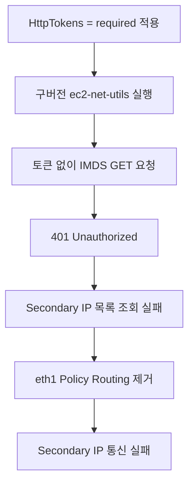

# EC2 Secondary IP 미적용 이슈: ec2-net-utils의 IMDSv2 호환성

> [홈](../../README.md) / [Troubleshooting](../README.md)
>
> 작성일: 2026-08-02 · 유형: 장애 분석 · 환경: Amazon Linux 2

## 개요

EC2 인스턴스의 메타데이터 옵션을 `HttpTokens=optional`에서 `HttpTokens=required`로 변경한 뒤 Secondary Private IP의 Policy Routing이 생성되지 않는 문제가 발생했다.

DHCP에서는 Secondary IP를 정상적으로 수신했지만, 구버전 `ec2-net-utils`가 IMDSv2 토큰을 사용하지 않고 메타데이터를 조회하면서 `401 Unauthorized`가 발생했다. 그 결과 Secondary IP 목록을 확인하지 못했고 기존 라우팅 규칙까지 제거되어 해당 IP를 사용하는 통신이 실패했다.

이 글은 특정 서비스나 시스템 구성을 다루지 않고, **IMDSv1에서 IMDSv2로 전환할 때 메타데이터 의존 도구를 함께 점검해야 하는 이유**를 중심으로 정리한다.

## 장애 요약

| 항목 | 내용 |
|---|---|
| OS | Amazon Linux 2 |
| 네트워크 | Secondary Private IP를 사용하는 추가 ENI |
| 문제 버전 | `ec2-net-utils-1.1-1.1.amzn2.noarch` |
| 비교 버전 | `ec2-net-utils-1.7.3-1.amzn2.noarch` |
| 변경 사항 | `HttpTokens=optional` → `HttpTokens=required` |
| 직접 원인 | 토큰 없는 IMDS 요청이 `401 Unauthorized`로 거부됨 |
| 영향 | Policy Routing 및 Route Table 미구성, Secondary IP 통신 실패 |

> 버전 비교는 장애가 발생한 환경의 검증 결과다. 모든 Amazon Linux 2 환경에서 `1.7.3`이 최소 요구 버전이라는 의미는 아니므로, 실제 적용 전 설치된 스크립트의 IMDSv2 지원 여부를 확인해야 한다.

## 변경 배경

IMDSv1은 토큰 없이 `169.254.169.254`로 요청할 수 있다. 애플리케이션에 SSRF 취약점이 존재하면 공격자가 이 경로를 통해 인스턴스 메타데이터나 IAM Role 임시 자격 증명에 접근할 가능성이 있다.

IMDSv2는 먼저 `PUT /latest/api/token`으로 세션 토큰을 발급받고, 이후 모든 `GET` 요청에 `X-aws-ec2-metadata-token` 헤더를 포함하도록 요구한다. 이는 SSRF 위험을 줄이는 방어 계층이지만 애플리케이션 자체의 SSRF 취약점을 해결하는 수단은 아니다.

메타데이터 옵션은 다음과 같이 변경했다.

```text
# 변경 전: IMDSv1과 IMDSv2 모두 허용
HttpTokens = optional

# 변경 후: IMDSv2만 허용
HttpTokens = required
```

## 발생 증상

Secondary IP를 추가하거나 DHCP 임대가 갱신될 때 다음 로그가 반복됐다. 실제 MAC 주소와 시간은 일반화했다.

```bash
sudo journalctl --since "<START_TIME>" \
  | grep -Ei '169\.254\.169\.254|metadata|401|ec2-net|dhclient|eth1|route|rule'
```

```text
[get_meta] Trying to get http://169.254.169.254/latest/meta-data/network/interfaces/macs/<MAC_ADDRESS>/local-ipv4s
[get_meta] Failed to get http://169.254.169.254/latest/meta-data/network/interfaces/macs/<MAC_ADDRESS>/local-ipv4s
[remove_rules] Removing rules for eth1
```

DHCP 바인딩 자체는 성공했다.

```text
dhclient: bound to <SECONDARY_PRIVATE_IP>
```

하지만 운영체제의 최종 네트워크 상태는 다음과 같았다.

- Secondary Private IP 메타데이터 조회 실패
- `ip rule`에서 해당 소스 IP 규칙 누락
- 인터페이스별 Route Table 미생성 또는 삭제
- Secondary IP를 소스로 사용하는 통신 실패

DHCP 성공은 IP를 전달받았다는 의미일 뿐, 소스 기반 Policy Routing까지 정상적으로 구성됐다는 의미는 아니다.

## 분석 과정

### 1. Metadata Option 확인

인스턴스 외부의 운영 단말이나 AWS CloudShell에서 현재 설정을 확인한다.

```bash
aws ec2 describe-instances \
  --instance-ids <INSTANCE_ID> \
  --query 'Reservations[0].Instances[0].MetadataOptions' \
  --output table
```

장애 당시 주요 설정은 다음과 같았다.

```text
HttpEndpoint             enabled
HttpTokens               required
HttpPutResponseHopLimit  1
State                    applied
```

### 2. 토큰 없는 요청과 IMDSv2 요청 비교

`HttpTokens=required`일 때 토큰 없는 요청은 `401`을 반환한다.

```bash
curl -sS -o /dev/null -w '%{http_code}\n' \
  http://169.254.169.254/latest/meta-data/instance-id
```

```text
401
```

IMDSv2 토큰을 발급받아 요청하면 정상적으로 조회된다.

```bash
TOKEN=$(curl -sS -X PUT \
  -H 'X-aws-ec2-metadata-token-ttl-seconds: 21600' \
  http://169.254.169.254/latest/api/token)

curl -sS \
  -H "X-aws-ec2-metadata-token: ${TOKEN}" \
  http://169.254.169.254/latest/meta-data/instance-id
```

특정 인터페이스의 Secondary IP 목록도 같은 방식으로 확인할 수 있다.

```bash
MAC=$(cat /sys/class/net/eth1/address)

curl -sS \
  -H "X-aws-ec2-metadata-token: ${TOKEN}" \
  "http://169.254.169.254/latest/meta-data/network/interfaces/macs/${MAC}/local-ipv4s"
```

### 3. ec2-net-utils 버전 비교

```bash
rpm -q ec2-net-utils
```

장애 서버와 정상 서버의 비교 결과는 다음과 같았다.

```text
ec2-net-utils-1.1-1.1.amzn2.noarch   # IMDSv2 Required에서 실패
ec2-net-utils-1.7.3-1.amzn2.noarch   # 동일 조건에서 정상 동작
```

### 4. IMDSv2 토큰 처리 구현 확인

Amazon Linux 2의 메타데이터 조회 함수에서 토큰 발급과 헤더 처리 여부를 확인했다.

```bash
grep -nEi 'latest/api/token|X-aws-ec2-metadata-token' \
  /etc/sysconfig/network-scripts/ec2net-functions
```

문제 버전에서는 검색 결과가 없었다. 즉 다음 처리가 구현되어 있지 않았다.

- `PUT /latest/api/token` 호출
- `X-aws-ec2-metadata-token-ttl-seconds` 헤더 전송
- 메타데이터 `GET` 요청에 `X-aws-ec2-metadata-token` 헤더 포함

### 5. Policy Routing 상태 확인

```bash
ip -4 addr show dev eth1
ip rule show
ip route show table all
ls -l /etc/sysconfig/network-scripts/{ifcfg,route}-eth1
```

Secondary IP가 인터페이스에 보이더라도 해당 소스 IP를 위한 `ip rule`과 전용 Route Table이 없다면 반환 트래픽이 잘못된 인터페이스로 나가 비대칭 라우팅이 발생할 수 있다.

## 원인

`ec2-net-utils`는 DHCP 임대 갱신 시 인스턴스 메타데이터에서 ENI와 Private IP 정보를 조회하고 Secondary IP 및 Policy Routing을 동기화한다.



이번 장애의 직접 원인은 IMDSv2가 아니라 **IMDSv1 방식으로 메타데이터를 조회하는 구버전 네트워크 도구를 점검하지 않고 `HttpTokens=required`를 적용한 것**이다.

## 복구 및 권장 대응

### 1. 임시 복구

서비스 복구가 우선이라면 인스턴스 단위로 IMDSv1을 일시 허용한다. `optional`은 IMDSv1 전용이 아니라 IMDSv1과 IMDSv2를 모두 허용하는 설정이다.

```bash
aws ec2 modify-instance-metadata-options \
  --instance-id <INSTANCE_ID> \
  --http-endpoint enabled \
  --http-tokens optional
```

변경 상태가 `applied`인지 확인한 뒤 영향받은 인터페이스 설정을 갱신한다.

```bash
sudo ifdown eth1
sudo ifup eth1
```

> `ifdown`은 해당 인터페이스의 연결을 끊는다. 관리 접속이나 서비스 트래픽이 `eth1`에 의존한다면 SSM Session Manager, EC2 Serial Console 또는 별도 관리 경로를 확보한 후 실행해야 한다.

### 2. ec2-net-utils 업데이트

저장소에서 제공하는 최신 호환 버전으로 업데이트한다.

```bash
sudo yum clean metadata
sudo yum update -y ec2-net-utils
rpm -q ec2-net-utils
```

업데이트 후 토큰 처리 구현과 네트워크 상태를 다시 확인한다.

```bash
grep -nEi 'latest/api/token|X-aws-ec2-metadata-token' \
  /etc/sysconfig/network-scripts/ec2net-functions

sudo service network restart
ip -4 addr show
ip rule show
ip route show table all
```

네트워크 서비스 재시작 역시 연결 중단 가능성이 있으므로 사전 복구 경로를 준비한다.

### 3. IMDSv2 Required 재적용

호환성과 라우팅을 검증한 후 보안 설정을 복원한다.

```bash
aws ec2 modify-instance-metadata-options \
  --instance-id <INSTANCE_ID> \
  --http-endpoint enabled \
  --http-tokens required
```

재적용 후 다음 항목을 확인한다.

- 토큰 없는 메타데이터 요청이 `401`인지 확인
- IMDSv2 토큰 요청과 메타데이터 조회 성공 확인
- Secondary IP가 인터페이스에 구성됐는지 확인
- 소스 IP별 `ip rule`과 Route Table 확인
- 실제 서비스 송수신 및 반환 경로 확인

## IMDSv2 전환 전 체크리스트

1. CloudWatch의 `MetadataNoToken` 지표로 IMDSv1 호출이 남아 있는지 확인한다.
2. 애플리케이션뿐 아니라 부팅 스크립트, 에이전트, 모니터링 도구, DHCP Hook도 조사한다.
3. AWS SDK, CLI와 운영체제 패키지를 지원 버전으로 업데이트한다.
4. `HttpTokens=optional` 상태에서 모든 호출이 IMDSv2로 전환됐는지 검증한다.
5. 일부 인스턴스에 먼저 `required`를 적용해 네트워크와 애플리케이션을 점검한다.
6. 검증 완료 후 Launch Template, AMI, 계정 기본값 순서로 적용 범위를 확대한다.
7. 컨테이너 환경은 `HttpPutResponseHopLimit` 값이 적절한지 별도로 확인한다.

## 유의사항

- Amazon Linux 2의 `ec2-net-utils`와 Amazon Linux 2023의 `amazon-ec2-net-utils`는 네트워크 구성 방식이 다르다.
- `HttpTokens=required` 변경 전에 인스턴스 내부에서 메타데이터를 호출하는 모든 구성요소를 확인해야 한다.
- Secondary IP 통신 장애는 IP 할당 여부만으로 판단하지 말고 `ip rule`과 Route Table까지 확인해야 한다.
- 임시로 `HttpTokens=optional`을 사용했다면 복구 완료 시점과 `required` 재적용 계획을 명시해야 한다.
- IMDSv2는 SSRF 위험을 줄이는 방어 계층이며 입력 검증, egress 제한, IAM 최소 권한도 함께 적용해야 한다.

## 결론

보안 설정 강화는 관련 의존성을 확인한 뒤 단계적으로 적용해야 한다. 이번 사례에서는 IMDSv2 Required 전환으로 구버전 `ec2-net-utils`의 메타데이터 조회 방식이 드러났고, 그 영향이 Secondary IP의 Policy Routing 삭제로 이어졌다.

가장 중요한 교훈은 **IMDSv2 전환 대상을 애플리케이션 코드에 한정하지 말고, 운영체제 네트워크 도구와 에이전트까지 포함해 점검해야 한다는 것**이다.

## 참고 문서

- [AWS - IMDSv2 사용으로 전환](https://docs.aws.amazon.com/ko_kr/AWSEC2/latest/UserGuide/instance-metadata-transition-to-version-2.html)
- [AWS - IMDSv2로 인스턴스 메타데이터 접근](https://docs.aws.amazon.com/AWSEC2/latest/UserGuide/configuring-instance-metadata-service.html)
- [Amazon Linux 2 - ec2-net-utils로 네트워크 인터페이스 구성](https://docs.aws.amazon.com/linux/al2/ug/ec2-net-utils.html)
- [AWS - EC2 Secondary IP 주소 구성](https://docs.aws.amazon.com/AWSEC2/latest/UserGuide/instance-secondary-ip-addresses.html)
